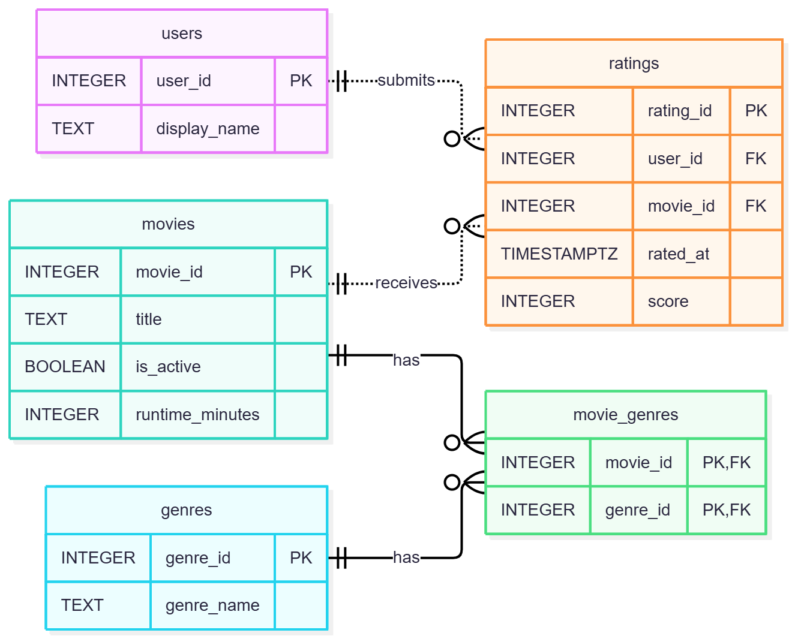

# Movie/TV Ratings Database

Relational database for a large-scale movie/TV ratings platform. EX603 BU course project.

**Theme:** Movie/TV

## Domain

This platform is designed to store information about users, movies, ratings, and genres. Each user can have one current rating per movie using a 5 star system. If a user changes their rating, their existing rating is updated. A movie can have multiple genres, and a genre can be used for multiple movies. The database also stores each movie's runtime and whether it is active.

The platform needs to answer questions such as which movies have the highest average scores, how many ratings each movie has, and which movies a user has rated. It also needs to show which movies belong to a selected genre and find active movies within a chosen runtime range. These questions use the relationships between users, movies, ratings, genres, and movie_genres.

## Entity Relationship Diagram

